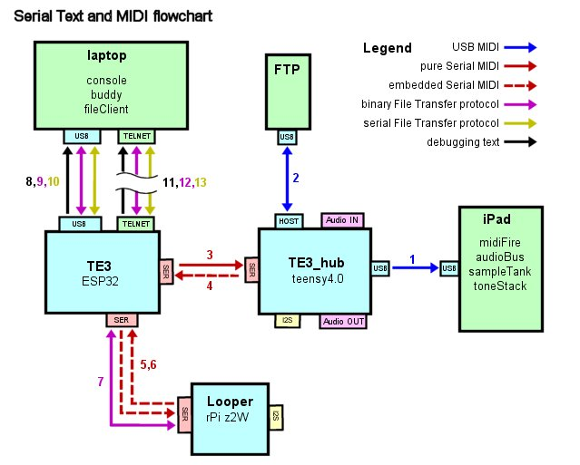

# TE3_common - Serial Text and MIDI

This document focuses on the MIDI and Serial Text (as opposed to Audio) data
and how it moves through the system

There are a number of parts to the design that will be referenced.

The **iPad** is an external computer that receives, processes, and transmits
USB Audio and which **receives**, but generally does not transmit, **USB MIDI**.
The iPad in this implementation *happens* to be running the MidiFire,
AudioBus, SampleTank, and ToneStack applications which add synthesized
sounds from SampleTank and Guitar effects from ToneStack to the incoming
USB Audio stream and send the modified audio stream back to the TE3_hub
via the USB connection.  This discussion is focused on the Serial Text
and MIDI in the system so does not show the Audio flow.  However, it
is useful to understand *why* we need to send MIDI to the iPad - in order
to play the synthesizer and control the guitar effects.

**FTP** is an acronym for the Fishman Triple Play synthesizer pickup.
The FTP **Dongle** is plugged into the USB Host port on the TE3_hub.
The FTP both transmits and receives USB MIDI over the USB Host port.

The **TE3_hub** is the **teensy4.0** USB Audio and MIDI device for the
vGuitar system. It attaches to the iPad via a USB cable and transmits
USB Midi to it. The TE3_hub also has the **USB Host** into which the
FTP Dongle is plugged. Finally, the TE3_hub is connected to the TE3
via a bidirectional Serial port.  The TE3_hub
receives *pure Serial MIDI* from the TE3 and sends *embedded
Serial MIDI* to it.

The **Looper** is a program running on an **rPi** (Raspberry Pi).
The Looper processes audio data from that came into the TE3 over
the USB Audio interface from the iPad and was sent to it via the
I2S protocol.  The Looper records tracks and/or mixes previously
recorded tracks (loops) back into the Audio data stream before
sending it back to the TE3_hub over I2s.  The Looper is controlled
and monitored via a bidirectional Serial port to the TE3 device.
It sends embedded Serial Midi and debugging text to the TE3 device,
and receives embedded Serial Midi from the the TE3. Although
technically, while running a different program, the circle Bootstrap
program, this same pair of Serial ports on the rPi and TE3
also transmit and receive the Binary File Transfer protocol which
is used to upload new Looper firmware (kernel.img files) to the rPi.

The **TE3** is the main program that represents the *Foot Pedal* portion
of the vGuitar system.  It can be connected to a Laptop or other
computer over a USB cable.  It knows how to route Serial data
between the Laptop, Looper, TE3_hub, and itself, which not only
includes Serial MIDI data, but also includes a number of other
protocols including binary and text file transfer protocols,
as well as knowing how to forwared debugging text output from all
the devices to the laptop.

Finally, the **laptop** computer is used for development, debugging,
and configuration of the system. The laptop is generally **NOT**
connected to the system, nor taken to gigs, when the system is
used for live performances.  However it is a crucial part of
the system, particularly for development and debugging, and
very useful for configuration.

## MIDI, USB Midi, pure Serial MIDI, and Embedded Serial MIDI

There is a more concise description of the various flavors of MIDI
used by this system in the **teMidi.h** file. We have mentioned four
different *kinds* of MIDI. Briefly, here is the explantation.

- **MIDI** (by itself) is a standardized **3 byte** protocol for
sending commands to, or receiving information from, a musical instrument
or other device. A standard MIDI message includes a *channel number*
from 1 to 16.
- **USB MIDI** is a standardized **4 byte** protocol that adds an
extra leading byte to the standard MIDI message.  This extra byte
allow the message to be addressed to 16 different *cables numbers*
(or *ports*).
- **Serial MIDI** (pure) is *my own protocol* that is essentially
the same 4 byte protocol as USB MIDI, except that it is sent over
a Serial, as opposed to a USB, port. Pure Serial MIDI requires that
the receiver ONLY expects to receive Serial MIDI messages into
its Serial port. Regular serial text can not be sent over the same
wire as "pure" Serial Midi Messages.
- **embedded Serial MIDI** is also *my own protocol* and is also
a 4 byte protocol, the same as USB MIDI. The difference is that
my embedded Serial MIDI protocol is limited to a specific set of
cable (port) numbers in such a way that messages CAN be unambiguously
mingled with regular serial text streams and the MIDI messages
can be "pulled out" of (anywhere in) the serial text stream, leaving
the serial text otherwise usable and unchanged.

That's the bird's eye view.

Basically it all started with the 3 byte "standard MIDI* back in the 70-80's.
You could have upto 16 different instruments hooked up to the same serial
stream and they could be assigned different channel numbers and you were
good to go.  The hardware protocol was a, crunchingly slow in todays world,
but quick enough back then, 31 kilobaud serial port, which was 31,000 bits
per second, or about 1000 midi messages per second.

Notice I did not use the word "devices" in my description of standard MIDI.

Then they came out with USB Midi.  USB Serial data could be in the mHz
ranges, sending millions of bits per second.  So they decided that they
would allow for 16 different virtual "cables" to be addressed by the
new 4-byte packet. These "cables" are also variously known as MIDI ports,
and (in MS Windows terminology) as separate "devices".

Thus when you plug the TE3_hub into your computer, you will see not one,
but a whole list of devices:

- a bi-directional Serial Port (i.e. COM14)
- a bi-directional USB Audio device (USB Audio In and USB Audio Out)
- 16 different MIDI "devices", each one corresponding to a "cable" number.

This is important to understand. For instance, the FTP dongle presents
itself over USB as two different MIDI devices. Basically one "cable"
or device represents the "performance" device (delivering the notes you
play on the guitar as MIDI message) and the other cable/device represents
the "control" device that includes things like Volume, Tuning, Patch
management, and so on.

So, when the TE3_hub finally gets around to sending USB MIDI messages
to the iPad, it needs to keep the messages from the FTP separate
from those from the TE3 (Foot Pedal), and so on.

That is why the TE3_hub must be able to receive "pure" Serial MIDI
messages.  Not only does it need to forward TE3 expression pedal,
button press, and rotary control messages to the iPad, but in fact
the TE3_hub itself is configured and controlled via that same
Serial MIDI cable. It's not clear from the above diagram or thus
far in this discussion, but the TE3_hub is also an **analog audio
device**.  That is, it takes analog input from the guitar (or a typical
line level audio device) as an input, and in the end, it outputs
sound as an line level output (or headphone jack) to an amplifier.
It has a pretty extensive set of controls for that purpose, including
adjusting the input and output levels, tone controls, and so on.
So the TE3_hub will "intercept" some MIDI messages sent to it
from the TE3 and will act on those messages to change it's
parameters.

Anyways, we need to go through each of the connections in more
detail.

## Details (by number)

I am going to re-include the above diagram here so that you don't have to
scroll up and down to see what I am talking about.

### (1) USB MIDI from TE3_hub to the iPad

The TE3_hub sends standard USB MIDI to the iPad. It is a one way connection;
the TE3_hub does not receive any USB MIDI from the iPad.  In doing so
the TE3_hub can appear as more than one MIDI device (port/cable) to the
iPad. There are 16 available, but I only envision using four.

- **teensyExpression1** - messages from the TE3 Foot Pedal to the iPad
- **teensyExpression2** - an optional second, separate device, for
  routing specific messages from different parts of the TE3
  Foot Pedal to the iPad on different cable numbers
- **Fishman Triple Play** - performance data that the TE3_hub gets
  from the FTP dongle via the USB Host port is generally sent to
  the iPad unchanged.
- **FTP Control** - is not generally used by the iPad, but can be
  used when the TE3_hub is plugged directly into the laptop for
  development and debugging. This involves the concept of
  **FTP Spoofing** which will likely be discussed elsewhere.

### (2) Bidirectional USB MIDI between TE3_Hub and FTP Dongle

As mentioned before, the FTP presents itself as two devices (cables/ports),
one for performance data, and the other for control functions.
However, it is way more complicated than it would first seem.

In general, as mentioned before, performance data from the FTP
is sent to the iPad over USB MIDI in order to trigger the synthesizer
to make sounds.  Therefore, in a time critical manner, the TE3_hub
must get that FTP performance data from the Host port and forward it
out of the USB port to the iPad.

However, the TE3 Foot Pedal has significant UI related to the
control and configuration of the FTP Dongle.  Specifically
it has UI and functionality to allow you to use the FTP as
a guitar Tuner and to adjust the FTP's per-guitar-string
senstivity settings.  To accomplish these functions the FTP
must be set into special "modes" with some fairly complicated
exchanges of MIDI messages.  Then, for instance, using the
guitar tuner functionality as an example, the TE3_hub needs
to keep track of MIDI note-on and note-off messages and communicate
those changes to the TE3 Foot Pedal (portion of the system).

Therefore, those note-on and note-off messages have to go BOTH
to the iPad (as they are performance data) and to the TE3
as they represent the notes being played during a tuning session.

Therefore the TE3_hub (program) is initimately aware of the FTP
and its state and knowledgable that certain messages must be sent
to initalize the FTP, to set it into certain modes, and so on.
As of this writing it is not clear how much of that will be
"built into" the TE3_hub program, and how much can be put off
on the TE3 program and handled via (pure and/or embeded) Serial
MIDI

In addition, there is another possibility that will likely be
built into the TE3_hub around the FTP that makes it even more
complicated.  It is possible that the FTP will NOT be plugged
directly into the TE3_hub, but instead the TE3_hub itself will
be plugged into "regular" USB HUB that will be plugged into the
iPad, and the FTP Dongle will be inserted into the regular
USB Hub.  That's the way it worked (best) in TE1 and TE2, and
I may need to build that into TE3 (and TE3_hub).

### (3) Pure Serial MIDI from TE3 to TE3_hub

There is no currently known requirement to send any text
or other protocols from the TE3 to the TE3_hub.

Therefore the TE3_hub can take advantage of the full
capabilities (cable numbers) available with full Serial
MIDI.

It is envisioned that one cable number (i.e. 15, zero based)
will be dedicated to messsages intended FOR the TE3_hub which
are used to control the SGTL5000 (audio codec chip) via MIDI.

A second cable number (i.e. 14) *may* be used for messages
directly to the TE3_hub for FTP related functionality.
Possibilities include:

- Toggling the FTP (and TE3_hub) "FTP Tuning Mode"
- Toggling the FTP (and TE3_hub) "FTP Sensitivity Mode"
- Specifying whether the FTP is connected to the Host Port or
to an external USB hub
- Specifying whether the TE3_hub is in "FTP Spoof" mode.
- Specifying where to send debugging text (MAIN USB versus
  the Serial port)

### (4) embedded Serial Midi from TE3_hub to TE3

The reason that this needs to be embedded, rather than
pure Serial MIDI is because the TE3_hub has the option
of sending it's debugging text messages out over the
same serial port as is used for Serial MIDI messages
to the TE3.

The lack of a cable number may be non-trivial, because
in practice the FTP uses almost all MIDI channel numbers,
and in addition to communicating it's state to the TE3,
TE3_hub must also communicate it's own state, as well
as the state of the SGTL5000 audio codec chip.

It may require significant careful work to do all of
this over a single MIDI "cable" (port) and remains
one of the largest design/implementation details as
the project moves forward.

### (5,6) Embedded Serial MIDI between TE3 and Looper

Fortunately the Looper side of this has already been coded and
is known to work. The Looper (rPi circle) implementation will
be virtually unchanged in TE3 from the TE2 version, including
the way the circle Bootstrapper works and the technique of
uploading new firmware to the rPi using a binary protocol.

Note that the Looper only **receives** embedded MIDI because
that is how it is currently coded.  It should not be difficult
to remove the cable number from messages destined for the Looper.
The Looper **sends** embedded MIDI because it, like the TE3 hub,
sends out its debugging text over the same wire as is used for
outgoing Serial MIDI messages.  This is, to repeat, already coded
and will be unchanged.

However the TE3 side still needs to be designed and implemented.

The TE3 side *largely* involves moving the guts of the previous
**teensyPiLooper** program into the TE3 repository. However, in
the teensyPiLooper program the TE2 was a separate serial device,
and the TE3_hub did not exist.

Therefore the enquing, routing, and dispatching of Serial MIDI
messages, including both "pure" and "embedded" versions needs
to be completely reworked.

But as I said, fortunately at least once piece of the puzzle
(the Looper) will be unchanged, so I merely need to fashion
the other piece (the TE3 implentation) so that it fits
correctly.

### (7) Binary File Protocol between TE3 and Looper

As with 5 and 6, fortunately the binary upload protocol and
the rPi bootstrap program will not need to be changed.
Nor do I envision any changes to the laptop **console**,
**Buddy** or **fileClient** programs.

However, as with 5 and 6, getting the previous teensyPiLooper
functionality that accomplished the binary protocol "mode"
will require some careful coding.

### (8) Debugging text to the console/Buddy program

Or Putty, for that matter.

The simplest and longest standing part of the system is the
Perl **console** script.  It can display text, including
text with embedded ANSI color and control codes that comes
in over a Serial port, or a Telnet port for that matter.

### (9,10) Binary and Serial File Transfer protocols

Inasmuch as the console/Buddy/fileClient programs will remain unchanged,
these protocols are already understood.

It is beyond this short document to describe how the console program
triggered the binary file transfer mode in the teensyPiLooper and/or
how the Serial File transfer protocol can be intermingled with regular
debugging text output, but I believe both of these tasks are "doable".

### (11,12,13) Telnet

In TE3 I am moving the the Foot Pedal (and teensyPiLooper) functionality
from a (pair of single core) teensies to a single dual core ESP32.
This is largely so that I will now be able to connect to the Foot Pedal
via the Wifi available on the ESP32, and not have to run a cable from
my laptop to the foot pedal on the floor across the room in order to
develop, debug, or configure it.

Essentially this amounts to the fact that anything I could send or
recieve via the TE3's USB Serial port can also be sent and received
via Telnet over Wifi.

In addition, though only a glimmer in my eyes, is the possibility that
the foot pedal might have an actual WebUI, perhaps based on my myIOT
framework, or written from scratch, that may make it *much easier*
for end users to configure.

## Current Summary

That's about it for this writing.  I need to start writing some
code and trying to tie some of these pieces together.

As of this writing I have build the TE3_hub and tested the
SGTL5000 teensy Audio shield RevD, and done basic testing of
the MIDI Host Port.

On a very personal note, I wish I had more thouroughly evaluated
the SGTL5000 / teenyAudio shield 5 years ago when I started this
project.   At that time I concluded the SGTL5000 was too noisy
for use in a pro-rig, which led to me using the iRig2HD audio
device, having a separate USB Hub, and then eventually all of the
trials and tribulations of interfacing the Audio Injector Octo
6 in, 8 out sound card to the rPi.

I now believe that the problem was not that the SGTL5000 was too noisy,
but rather, that I did not understand it well enough, nor did I experiment
with it enough, to determine the optimum configuration and settings
for use with my application.  Although the CS42448 (Octo) codec purports
a better (like 105db) SNR than the SGTL5000 (like 85-95db), in fact,
nobody ever achieves anything close to the capabilities of the chips
in practice.  In fact if one can approach 70db SNR on the actual
device, then it will sound more or less professional with no really
noticible hum or distortion.   But I looked at two numbers on two
datasheets and decided it was the codecs that were the difference.

My recent experiments are confirming that with careful adjustment
I can get the SGTL5000 to sound "good enough" which, coupled with
using the teensy4.0 as both the USB Host and USB Audio/MIDI device,
removes about 80% of the bulk of the hardware and several cables
and connectors from the design.

Gone are:

- 6 channel USB Hub
- Bulky Octo Sound Card
- The finicky iRig2HD circuit board
- a separate teensy3.2 just to control the Looper rPi

And I'm also gonna replace the rPi 3B+ with an rPi Zero 2W which
provides the same 4 core processor with plenty of RAM in about
1/4 of the space that the rPi 3B+ took, esp since I did not use
ANY of the 4 big USB ports or ethernet port.

I may be able to put it all on a single circuit board,
eliminating almost all wired interconnections between
processors (between TE3, TE3_hub, and the rPi looper)!

More later ....

## Please also see

[**TE3_hub**](https://github.com/phorton1/Arduino-TE3_hub)
The parent **USB Audio and MIDI interface** with a **USB Host** port
for the vGuitar System.

[**TE3**](https://github.com/phorton1/Arduino-TE3)
The **Foot Pedal** part of the vGuitar System.

The [**circle-Looper**](https://github.com/phorton1/circle-prh-apps-Looper)
repo contains the source code for the *Looper application* part
of the vGuitar System.
